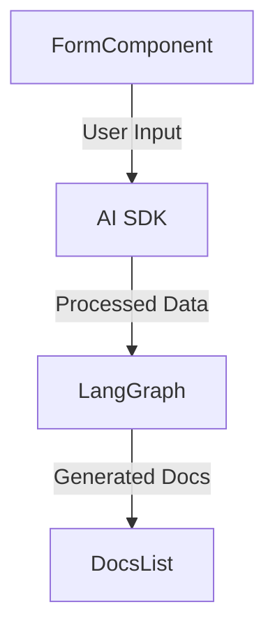

# System Architecture Patterns

## Documentation Generation Flow

1. **User Input**: FormComponent collects documentation requirements
2. **Processing**: AI SDK and LangGraph process the input
3. **Output Generation**: Documentation files are generated
4. **User Feedback**: DocsList displays generated documentation

## Component Relationships

## UI Patterns

* **Radix UI Integration**: Used for accessible dialog and form components
* **Component Hierarchy**:
  - FormComponent handles input collection
  - DocsList manages documentation display
  - Radix Dialog provides modal interactions

## Data Flow

1. User input collected via FormComponent
2. Data processed through AI SDK and LangGraph
3. Generated documentation stored temporarily
4. DocsList retrieves and displays documentation
